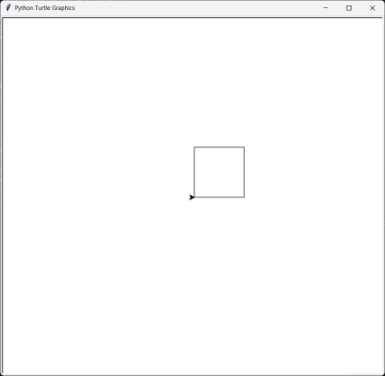
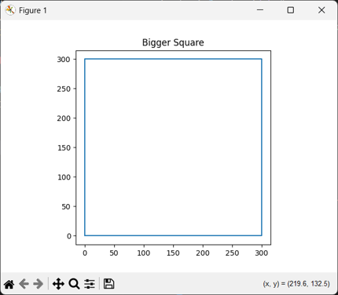

# Pascal's Triangle

## Expected Output

    Enter the number of rows: 5
    1
    1 1
    1 2 1
    1 3 3 1
    1 4 6 4 1

------------------------------------------------------------------------

# Draw using Coords

------------------------------------------------------------------------

# Sockets

## Expected Output (Server)

    Server listening on 127.0.0.1:5001
    Connected by ('127.0.0.1', 54906)
    Received message: Top Secret Message!

## Expected Output (Client)

    Message sent to server.
